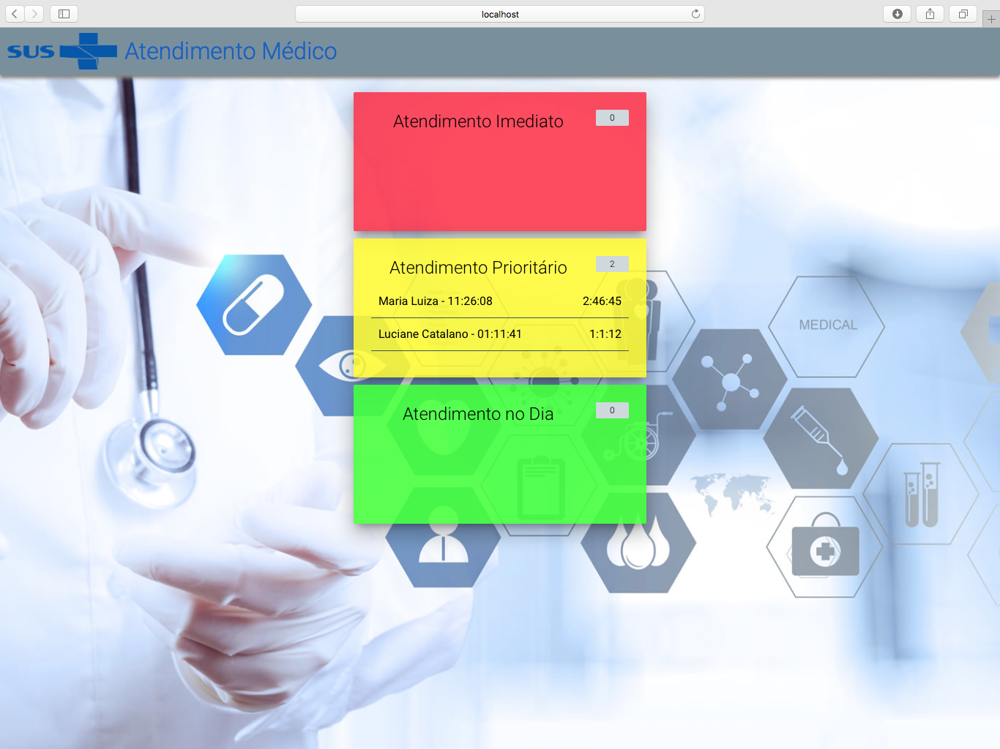

#Ministério da Saúde

A aplicação é dividida em 3 partes :

1. Recepção
2. Acolhimento
3. Doutor

##Recepção

A parte de recepção é acessada via https://min-saude.mybluemix.net/recepcao , ela é a parte onde a aplicação pede o número SUS do paciente em seguida o número é verificado com a base de dados e se o número SUS for válido , a aplicação verifica se o paciente tem uma atividade agendada, caso tenha, a aplicação mostraria a consulta agendada e pediria para encaminhar o paciente para a sala certa. 
Caso o paciente não tenha atividade agendada,  a aplicação pergunta sobre o motivo da vinda na recepção. 
A aplicação espera dois casos de resposta, a primeira é a rotina da UBS como por exemplo exames, vacina ,farmácia , curativo e vacina e a segunda resposta é sobre algo espontâneo como por exemplo o paciente está com dor,  precisa de acolhimento…

Após isso, a aplicação redireciona para o setor correto.

  

Script: 

Bot: Olá sou o Watson, informe o número do cartão SUS para iniciar o acolhimento.
Usuário: 123qwe
Bot: Informe um número válido por favor
Usuário: 12345
Bot: O paciente João da Silva não possui nenhuma atividade agendada , qual é o motivo de vinda ?
Usuário:  O paciente está com dor.
Bot: Encaminhe o paciente João da Silva para o acolhimento.

  

Script com atividade agendada. 

Bot: Olá sou o Watson, informe o número do cartão SUS para iniciar o acolhimento.
Usuário: 123
 Bot: O paciente Maria Luiza possui uma atividade agendada, encaminhe o para Dr. Alberto - Sala 300
O paciente precisa de atendimento especifico da unidade ou acolhimento ?
Usuário: Não.	

Obs: para ter atividade agendada, tem quem cadastrar no cloudant.

  

 
##Acolhimento

A parte de acolhimento é acessada via https://min-saude.mybluemix.net/acolhimento , ela é a parte onde recebe os pacientes que passaram pela recepção e nela monta uma fila de espera para atende-los. 

  

Ao clicar no nome do paciente a aplicação pede para confirmar a inicialização  do processo de acolhimento do paciente.

  

Confirmando a ação a fila some da tela e o Bot aparece para fazer as perguntas especificas sobre o paciente. 
A aplicação procura na base de dados ( Cloudant ) o paciente , e em seguida confirma a idade do paciente , pois o cadastro no SUS pode estar desatualizado. 
Confirmando a idade, a aplicação mostra na tela as informações do paciente e o Bot inicializa o processo de perguntas de acolhimento
Ao coletar as respostas das perguntas, a aplicação mostra na tela as informações

  

**Métrica de avaliação**

  

Essa tabela funciona assim:  

qualquer item que estiver na coluna de vermelho (com excessão da febre) é  atendimento imediato ,  qualquer item que estiver na coluna amarelo (incluindo a febre), é atendimento prioritário.

Não tá na tabela mas: frequência respiratória acima de 25 ou abaixo de 16 é amarelo  

**Após isso, o Bot daria a orientação, baseado nos protocolos de atendimento do governo.**

No primeiro script o bot consegue detectar que a possível doença  é faringite viral

**1- Script**

Bot: De acordo com cadastro do cartão SUS, a idade é 24 anos. Está correto?
Usuário: Sim  ou Não, o correto é XX ( se a idade for incorreta, a aplicação corrige conforme informado )
Bot: Qual é a queixa de Maria Luiza?
Usuário: Dor de garganta e mal estar
Bot: Há quanto tempo está com Dor de garganta e mal estar?
Usuário: Dois dias
Bot: Pode informar mais detalhes ? Mais alguma dor?
Usuário: Todo dia de manhã minha garganta dói muito. Depois melhora um pouco. Tenho mal estar o dia todo.
Bot : A paciente está gravida ? ( se o sexo é feminino  e não idosa)
Usuário: Sim ou Não
Bot: Favor informar a temperatura.
Usuário: 38
Bot: Favor informe a frequência cardíaca.
Usuário: 76
Bot: Favor informar a frequência respiratória
Usuário: 82
Bot: Favor informar a pressão arterial
Usuário:  8 x 6 
Bot: Favor informar a glicemia capilar.
Usuário: 66
Bot: Favor informar a saturação de O2
Usuário: 78

  

Bot: Está com dor no peito ?
Usuário: Sim
Bot: Paciente qualifica-se como atendimento imediato
Bot : Conforme o protocolo de atendimento (dor de garganta), já providenciar gargarejo com solução salina e acomodar até o atendimento médico.

  

Neste caso o paciente é do sexo feminino e não , e com isso o bot pergunta se está gravida.

Ao clicar no icon ( X ) , as informações  do paciente somem, e a fila dos pacientes volta menos o paciente atendido . E assim o paciente atendido será redirecionado para a fila específica  ( imediato / prioritário / normal )  de espera do médico 

**2 - Script**

O caso de Luciane Catalano de 70 anos.

Bot: De acordo com cadastro do cartão SUS, a idade é 56 anos. Está correto?
Usuário: Sim  ou Não, o correto é XX ( se a idade for incorreta, a aplicação corrige conforme informado )
Bot: Qual é a queixa de Maria Luiza?
Usuário: cansaço e falta de ar
Bot: Há quanto tempo está com Dor de garganta e mal estar?
Usuário: 4 dias
Bot: Favor informar a temperatura.
Usuário: 39 graus
Bot: Favor informe a frequência cardíaca.
Usuário: 112 bpm
Bot: Favor informar a frequência respiratória
Usuário: 22
Bot: Favor informar a pressão arterial
Usuário:  14 x 8
Bot: Favor informar a glicemia capilar.
Usuário: 100
Bot: Favor informar a saturação de O2
Usuário: 97
Bot: Está com dor no peito ?
Usuário: Não
Bot: Tem diabetes?
Usuário: Sim 
Bot: O paciente já está cadastrado no programa de diabéticos e tabagismo?
Usuário: Sim
Bot: Paciente qualifica-se como atendimento imediato

Bot : Administrar antitérmico

Neste caso , como a pessoa é de sexo feminino mas ela é idosa, o Bot não pergunta se está gravida. 
E como a pessoa é idosa, o Bot pergunta se tem diabetes, caso a resposta seja sim ele pergunta se o paciente está cadastrado no programa de diabéticos  e tabagismo.

A aplicação mostra as informações do paciente com a fila detectada e em seguida será transferido para a fila do médico.

##Doutor

A parte de Médico é acessada via https://min-saude.mybluemix.net/doutor , ela é a parte onde recebe os pacientes que passaram pelo acolhimento e nela monta 3 filas de espera para atende-los ( Atendimento Imediato , Atendimento Prioritario e atendimento no Dia) . 

  

Ao clicar no nome do paciente na fila, uma mensagem de confirmação para atender ele aparece, ao confirmar , a aplicação  busca as informações do paciente e mostra na tela.

  

Dependendo das informações passadas no acolhimento, a aplicação analisa o caso e mostra as possíveis doenças  que o paciente possa ter, além de permite o médico perguntar sobre as doenças  e a aplicação  traz informações sobre a pergunta.

**Script:**

O caso da Maria Luiza, de 24 anos , e que está com dor de garganta.

Bot: Parece que o paciente está com doença do aparelho respiratório.
        Realize verificação visual e vou te ajudar a atendê-lo
        A principio as possiveis doenças são: Toxoplasmose,Gripe,Faringite e Bronquite.
      Quando quiser,me pergunte sobre essas doenças.
Medico: Exame físico OK. Vamos encaminhá-lo para o <Especialidade>. Preencha a conduta e ficha de encaminhamento.

Bot: Para realizar esse encaminhamento, é necessário que todos os passos do protocolo de atenção à Diabetes Mellitus na UBS tenham sido seguidos.

As condições clínicas que indicam a necessidade de encaminhamento para a Endocrinologia são:
- Paciente em uso de insulina em dose otimizada (mais de uma unidade por quilograma de peso);
- Paciente com doença renal crônica (taxa de filtração glomerular (TFG) < 30 ml /min/1,73m2 (estágio 4 e 5);
- Paciente com DM tipo 1 (uso de insulina como medicação principal antes dos 40 anos);

Verifiquei no Prontuário e não há registro de uso de antidiabético oral ou insulina no paciente. Confirme o encaminhamento apenas para os casos clínicos acima.

Para um paciente que não apresenta os casos clínicos acima, o uso de antidiabético oral por 3 meses e se necessário a substituição por um segundo tipo de antidiabético oral por mais 3 meses. Se após esses procedimentos o paciente não atingir a meta e não estiver compensado, associar insulina.	

Medico: Me fale os sintomas de faringite

Bot:  Adultos com faringite geralmente se queixam de dor de garganta, particularmente quando engolir. A febre é freqüentemente presente com faringite bacteriana e pode ocorrer em associação com dor de cabeça ou mal-estar. Os pacientes podem observar "glândulas inchadas" ou dor no pescoço anterio…

** O bot dar a opção de ler mais, onde mostra o conteúdo inteiro.

Medico: Ok. Vamos prescrever antidiabético oral e marcar o retorno para daqui a 90 dias com exames atualizados.
Bot:  Perfeitamente, CID e prescrição básica preenchida para Maria Luiza que tem 24 anos e 90 kg  Favor revisar os itens em vermelho.

  

A aplicação preenche os exames requeridos com os medicamentos com o retorno na parte de prescrição, e também  busca o número CID e preenche o diagnóstico  médico. 

Caso o médico  mude o número  CID, a aplicação verifica se o número CID válido , se o novo número CID inserido , a aplicação avisa o médico  da mudança  e qual doença  esse CID representa.

  

Ao clicar na no botão 

  

A aplicação  mostra o resultada e finaliza o caso do paciente

  

